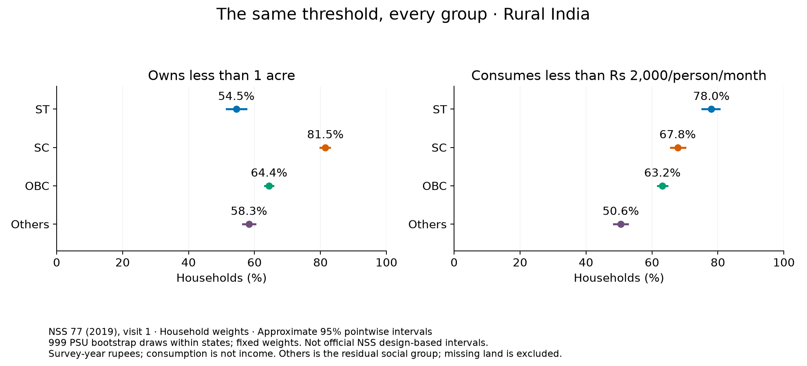
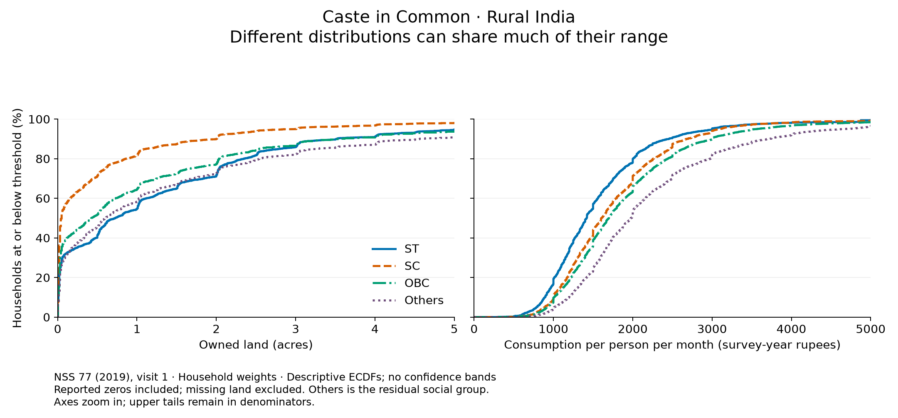
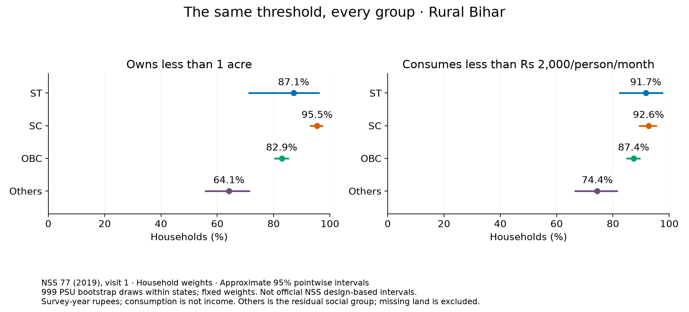
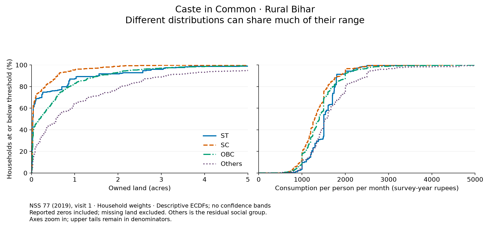

# First look: land and consumption

Exploratory estimates from NSS 77, visit 1. Social groups are the survey's reported ST, SC, OBC and Others categories. Others is not a verified upper-caste category.

Approximate 95% pointwise percentile intervals: 999 PSU bootstrap draws within states, fixed household weights; seed 20260910. This approximation does not reproduce NSS substratification, later sampling stages, or finite-population corrections. It is not an official NSS variance estimate.

## Rural India

58,035 households; 62 lack a land block and are excluded from land denominators. Consumption includes all households.

| Group | Owns <1 acre | Consumes <Rs 2,000/person/month |
|---|---:|---:|
| ST | 54.5% [51.5, 57.4] | 78.0% [75.3, 80.5] |
| SC | 81.5% [79.9, 82.8] | 67.8% [65.7, 70.0] |
| OBC | 64.4% [63.1, 65.6] | 63.2% [61.7, 64.7] |
| Others | 58.3% [56.5, 60.2] | 50.6% [48.4, 52.6] |

For owned land, an independently drawn SC household has a larger value than an Others household in **31.8%** of pairs, a smaller value in **65.2%**, and ties in **3.0%**. These pairwise estimates are descriptive and have no intervals in this pilot.

For per-person consumption, an independently drawn SC household has a larger value than an Others household in **36.0%** of pairs, a smaller value in **63.6%**, and ties in **0.4%**. These pairwise estimates are descriptive and have no intervals in this pilot.

## Rural Bihar

5,111 households; 7 lack a land block and are excluded from land denominators. Consumption includes all households.

| Group | Owns <1 acre | Consumes <Rs 2,000/person/month |
|---|---:|---:|
| ST | 87.1% [71.3, 96.1] | 91.7% [82.5, 97.6] |
| SC | 95.5% [93.2, 97.3] | 92.6% [89.5, 95.3] |
| OBC | 82.9% [80.5, 85.1] | 87.4% [84.9, 89.5] |
| Others | 64.1% [55.9, 71.2] | 74.4% [66.6, 81.5] |

For owned land, an independently drawn SC household has a larger value than an Others household in **17.2%** of pairs, a smaller value in **80.5%**, and ties in **2.3%**. These pairwise estimates are descriptive and have no intervals in this pilot.

For per-person consumption, an independently drawn SC household has a larger value than an Others household in **30.5%** of pairs, a smaller value in **67.6%**, and ties in **1.9%**. These pairwise estimates are descriptive and have no intervals in this pilot.

## Reading the results

Substantial overlap can coexist with large gaps in typical resources and threshold rates. The comparisons do not estimate an effect of caste, establish equal opportunity, or evaluate a reservation policy. Land quantity is not land value or total wealth; consumption is not earnings. Rupee thresholds are historical nominal benchmarks, not present-day poverty lines.

Reported zero land includes amounts rounded to 0.00 acres by the source. Sparse land categories are filled with zero only after reconciliation to the reported household total; wholly absent land blocks remain missing. The threshold CSVs provide worst-case bounds for those missing outcomes.

The pairwise CSV separately reports ties and a fixed-bin overlap coefficient. Its value depends on bin edges and is not a percentage of people who are economically identical. Pooled-rank thresholds use the inverse weighted ECDF; ties mean a pooled quartile need not contain exactly 25% strictly below it.

See [the design](../docs/design.md) and [source audit](../docs/sources.md) for scope, definitions and the next data sources.
