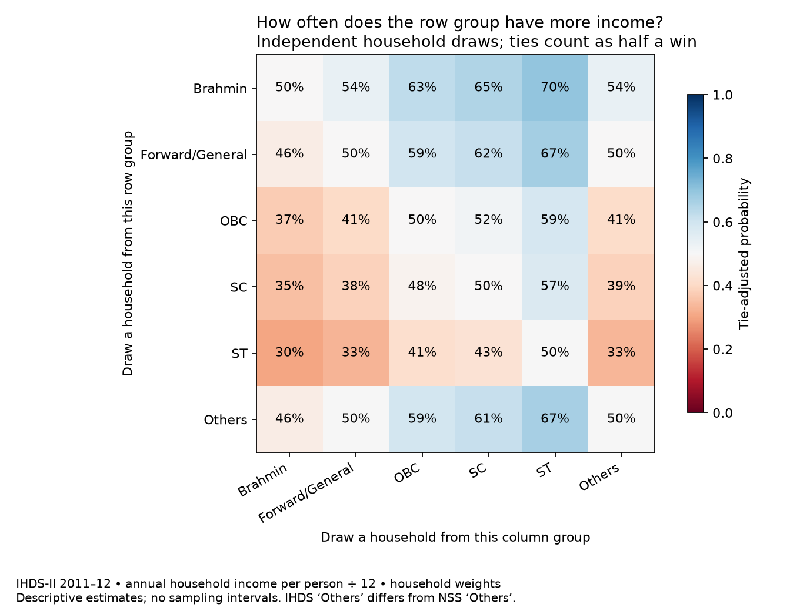
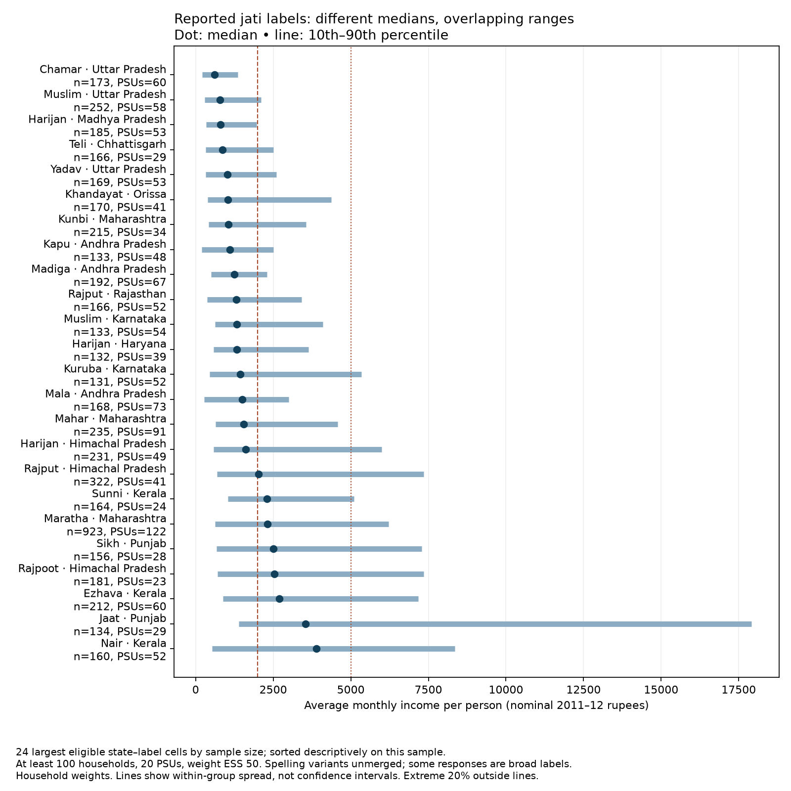
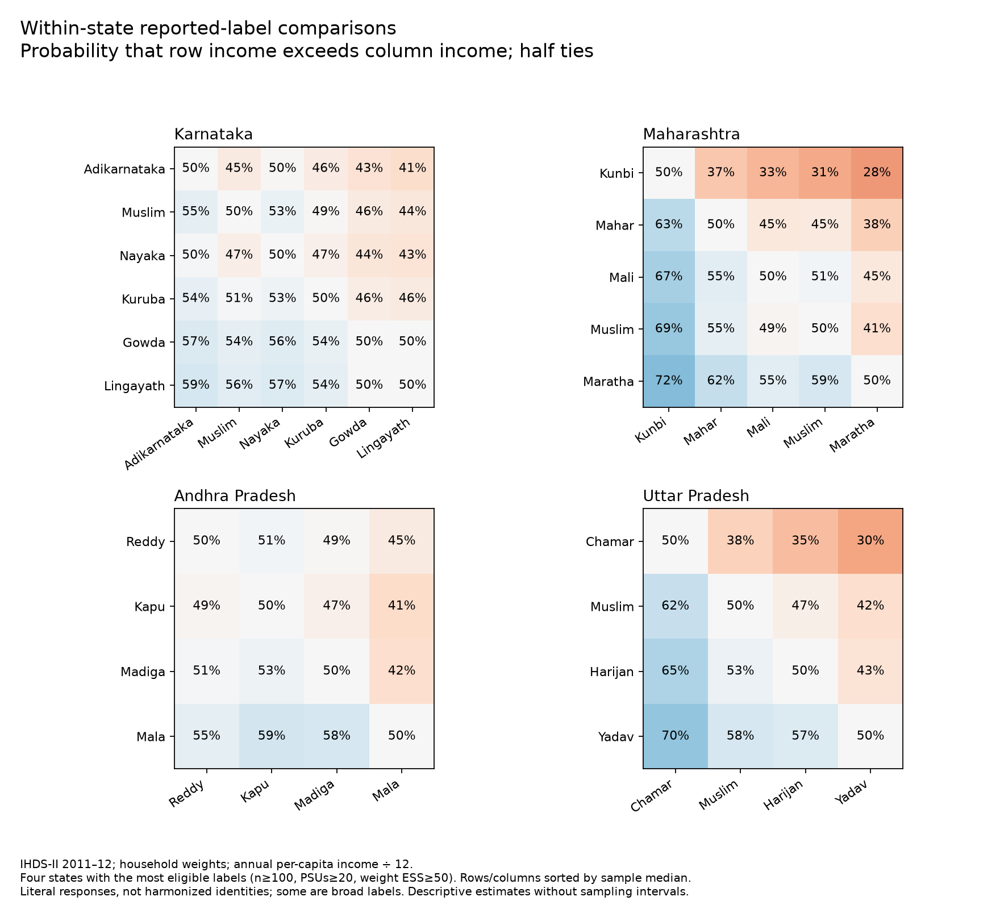

# IHDS-II: income and reported jati labels

Generated from ICPSR 36151 DS0002. Survey period: 2011–12. Income is annual net household income divided by household size and 12, not observed month-by-month cash flow. Amounts are nominal survey-year rupees.

## Same cutoff, different groups

Percent of households below the cutoff; household weights, all India (rural and urban). These are illustrative cutoffs, not official poverty lines.

| Group | Below ₹2,000/person/month | Below ₹5,000/person/month |
|---|---:|---:|
| Brahmin | 50.9% | 79.0% |
| Forward/General | 56.5% | 84.3% |
| OBC | 70.2% | 92.5% |
| SC | 74.4% | 95.2% |
| ST | 80.6% | 95.0% |
| Others | 55.9% | 81.5% |

## Two random draws

Forward/General (excluding Brahmins) has greater per-person income than OBC in **59.5%** of independent household pairs; OBC has greater income in **40.5%**; **0.06%** tie. Half-tie AUC: **0.595**.

## Reported labels, ordered descriptively

44 state–label cells meet n≥100, PSU≥20, Kish weight ESS≥50. Kish ESS describes unequal weights, not clustering-adjusted precision. Only case and whitespace are normalized; these are not harmonized jati identities. Spelling variants and broad/religious responses remain separate.

## Held-out prediction

Fixed bins: <0; [0,1000); [1000,2000); [2000,5000); [5000,10000); ≥10000 rupees/person/month. Five folds hold complete PSUs out. Every household is evaluated, including missing/unseen-label fallbacks. Each eligible training cell needs 30 households and 5 PSUs; its probabilities shrink toward its parent using weight ESS and a prior of 10, 30, or 100 effective households. Scores are model-dependent, not an estimate of all information potentially contained in actual jati.

Mean across three splits, prior=30. Lower log loss is better. Coverage is the household-weighted share receiving an eligible cell's prediction at that level; the rest use a parent prediction.

| Information supplied | Log loss (nats) | Own-level coverage |
|---|---:|---:|
| None | 1.3908 | 100.0% |
| Broad caste only | 1.3695 | 100.0% |
| State × rural/urban | 1.2747 | 98.5% |
| Geography + broad caste | 1.2672 | 94.5% |
| Geography + broad caste + literal jati response | 1.2675 | 19.6% |

All seeds and prior sensitivities are in `ihds_prediction.csv`. Split variation is not a confidence interval. Geographic adjustment removes part of what a geographically concentrated jati may predict. This resolution cannot measure distinctions within the top ₹10,000+ bin.

## Does higher income identify a caste?

Households at or above ₹10,000 per person per month, in 2011–12 rupees. Composition is P(group | in tail); lift divides it by the population share. Recall is P(in tail | group). These describe different directions of inference.

| Group | Population share | Tail composition | Lift | Group in tail |
|---|---:|---:|---:|---:|
| Brahmin | 4.9% | 13.9% | 2.83 | 7.3% |
| Forward/General | 21.0% | 38.3% | 1.82 | 4.7% |
| OBC | 42.1% | 31.0% | 0.74 | 1.9% |
| SC | 22.1% | 8.4% | 0.38 | 1.0% |
| ST | 8.3% | 4.6% | 0.56 | 1.4% |
| Others | 1.5% | 3.0% | 2.05 | 5.3% |

The denominator includes missing broad groups; therefore displayed composition shares need not sum to 100%. Detailed-jati inference requires a reviewed label crosswalk.

## Audit and limitations

- 42,152 unique households; 1,547 in Bihar; 2,462 complete PSU identifiers.
- 452 negative and 166 zero annual income reports retained.
- 86 missing broad groups are an explicit category in prediction and tail denominators.
- IHDS Others is code 6, distinct from both Forward/General and the NSS residual Others. No upper-caste merge is imposed.
- Threshold and pairwise CSVs include household and person weighting; plots use household weights. Person draws assign household per-capita income.
- Tail CSV includes prior shares, posterior composition, lift, group recall, and unweighted household/PSU support. It tests the reverse conditional.
- These are descriptive pilot estimates without sampling confidence intervals. Do not interpret sample median ordering as a precise population hierarchy.
- No present-day rupee conversion or annual mobility has been estimated.

See [methods and wider data search](../docs/informativeness.md) and [IHDS ingestion audit](../docs/ihds-audit.md).
